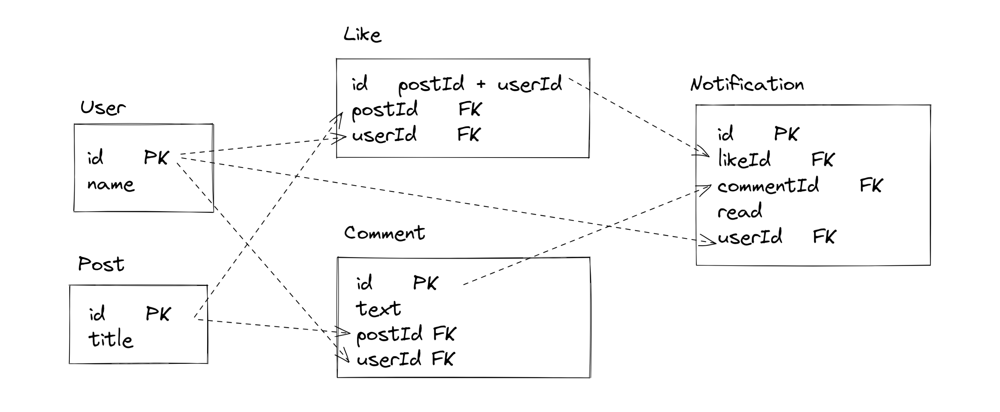

# PHRASEE BACK END TECHNICAL TEST
## To run
```shell
docker compose up
```

## To populate with seed data
- to use different seed data, save seed data as `data.json` in the `seed` folder
```shell
# run inside the docker container
npm run seed
```

## Design


### Decision for a relational database rather than just json
- upsert functionalities and schema validation
- ORM benefits
- easier to expand in the future, e.g. get my likes and comments

### Notification, Like, Comment table separation
- notification table holds all the notifications for all users
  - one comment on post can lead to the notification of multiple people, only the information that is needed is repeated
  - the user in the notification table is anyone BUT the author of the notification
- notification could be in the future just a file or in a nosql db to improve performance

## To Improve
- better error handling
- validation of inputs
- like - assuming that cannot recreate the same like
- tests
- have notifications and likes and comments tables loosely coupled - not dependent on foreign keys - this way if someone deletes the comment, the notificaiton history stays


## Instructions
You are tasked with writing the algorithm that takes a feed of notifications and aggregates them. The
algorithm should be packaged in a web server that exposes three endpoints:
- The first endpoint will provide the functionality to retrieve an aggregated list of notifications for a
given post. We are looking for a response that is as close to production ready as possible.
- The second endpoint will expose a POST method that will add an element to this feed of
notifications.
- The third and last endpoint should expose the functionality to mark these feeds as read.

The notification feed is from a hypothetical social website that allows users to write posts, like posts
and comment on posts.

- The notifications can be of two types: Like and Comment.
- Like indicates that one user liked a user's post and Comment indicates that one user commented on a user's post.

You'll be provided with a file containing a JSON of the notifications feed.

Use your judgement for a suitable aggregation bearing in mind this will be displayed on a web UI.
Please note that the order in which the notifications are served or aggregated is irrelevant.

Please do not take more than approximately 4 HOURS on this test.
If you find you cannot complete it to your satisfaction, please write down how you would intend to
finish, we will take that into account.

The test results should be packaged either as a .zip file or as a link to a git repository.
